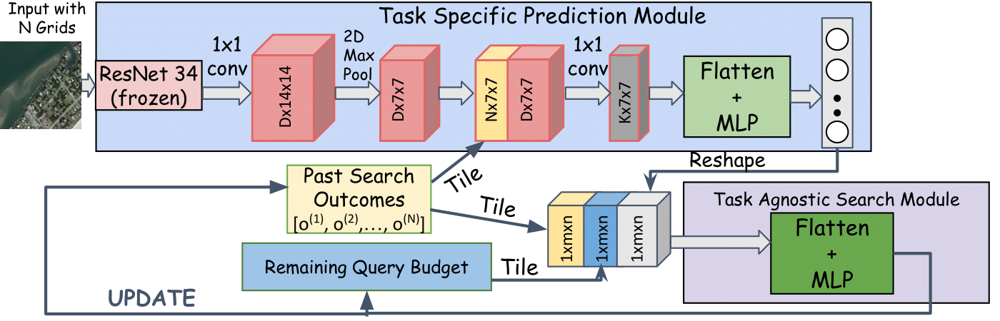

# A Partially Supervised Reinforcement Learning Framework for Visual Active Search
This repository contains implementation of our work titled as __A Partially Supervised Reinforcement Learning Framework for Visual Active Search__. We propose a partially Supervised reinforcement learning framework for Visual Active Search. 



**PDF**: https://arxiv.org/abs/2310.09689

**Authors**: Anindya Sarkar, Nathan Jacobs, Yevgeniy Vorobeychik.

-------------------------------------------------------------------------------------
## Requirements
**Frameworks**: Our implementation uses **Python3.5** and **PyTorch-v1.4.0** framework.

**Packages**: You should install prerequisites using:
```shell
  pip install -r requirements.txt
```
**Datasets**:


**xView**: You can find the instructions to download images [here](https://challenge.xviewdataset.org/data-format). After downloading the images along with **xView_train.geojson**, you need to run the following script. It will generate a csv file containing the image-path and it's corresponding grid-label sequence. Don't forget to change the directory.

```shell
  python3 Prepare_data.py
```
**DOTA**: You can find the instructions to download images [here](https://captain-whu.github.io/DOTA/index.html)

The label files corresponds to each different settings (including DOTA and xView) we consider in this work can be downloaded from the following Google Drive folder link: https://drive.google.com/drive/folders/1ATpYBdnO7G3GcZb20CODZ0ReNRQlXh78?usp=share_link

## Training
**Train the MPS-VAS Policy Network**


To train the policy network on different benchmarks including **xView**, **DOTA** dataset:

```shell
  python3 train-MPSVAS.py
```


Note that, train-MPSVAS.py script is used to train the MPS-VAS policy with large Vehicle as target class from DOTA and 6 * 6 grid structure.
In order to train MPS-VAS in different settings as reported in the paper, modify the following:
1. Use the **appropriate model class** for each settings as defined in utils.py ( for example, in order to train MPS-VAS with small car target class from xView and with 11 * 9 grid structure, use the model class (Model_search_Arch_Adapt_pred, Model_search_Arch_Adapt_search_meta) defined in line 600 to line 700 in utils.py. MPS-VAS policy architecture for each setting is also defined in utils.py. We mention the setting name just above the model class definition in each settings. MPS-VAS policy architecture for all different settings we consider is defined between line 502 to line 700 in utils.py script inside utils_c folder.
2. Specify the **right train/test csv file path** as input for that particular setting in "get_datasetVIS and "get_datasetVIS_Classwise" function as defined in utils.py. Provide the path of train csv file in line 343 of utils.py and test csv file in line 347 and 359 of utils.py.
3. Provide the **appropriate label file** for that particular settings in dataloader.py script in the dataset folder. Specifically in line 189 and in line 230.
4. Provide the **appropriate value for num_actions** in line 6 of constant.py. For example, in case of 6 * 6 grid structure, num_actions = 36. Also modify the coord function defined in vas_train.py/vas_test.py based on grid structure.

**Train the PSVAS Policy Network**

To train the policy network on different benchmarks including **xView**, **DOTA** dataset:

```shell
  python3 train-PSVAS.py
```
Note that, train-PSVAS.py script is used to train the PSVAS policy with large Vehicle as target class from DOTA and 6 * 6 grid structure.
In order to train PSVAS in different settings as reported in the paper, follow the exact same modification instructions as mentioned above for the training MPS-VAS policy. For example:
1. Use the **appropriate model class** for each settings as defined in utils.py ( for example, in order to train PSVAS with large vehicle target class from DOTA and with 8 * 8 grid structure, use the model class (Model_search_Arch_Adapt) defined in line 791 to line 877 in utils.py. PSVAS policy architecture for each setting is also defined in utils.py. We mention the setting name just above the model class definition in each settings. PSVAS policy architecture for all different settings we consider is defined between line 705 to line 1088 in utils.py script inside utils_c folder.

## Evaluate
**Test the MPS-VAS Policy Network**

To test the policy network on different benchmarks including **xView**, **DOTA** dataset:

```shell
  python3 test-MPSVAS.py
```

In order to test MPS-VAS in different settings, follow the exact same modification instructions as mentioned above for the training part.
Note that, the provided code is used to test MPS-VAS in **uniform query cost** setting, where, we assign the cost budget in line 56. In order to test VAS in **distance based query cost** setting, assign the cost budget in line 85 and uncomment the lines from 120 to 130. 

**Test the PSVAS Policy Network**

To test the policy network on different benchmarks including **xView**, **DOTA** dataset:

```shell
  python3 test-PSVAS.py
```

In order to test PSVAS in different settings, follow the exact same modification instructions as mentioned above for the MPS-VAS Policy evaluation section.

We provide the trained policy model parameters (including MPS-VAS framework, PSVAS framework, and Multi-query framework) for each settings in the following Google Drive folder link:
https://drive.google.com/drive/folders/1KuIMLblsQuBe75OjVJvLlTynk2mtgump?usp=share_link

For example, the trained MPS-VAS policy model parameters when trained with large vehicle as target and number of grids as 36 is saved in files named as model_vas_dota36_lv_adapt_F_meta_pred (to store the weights for prediction module) and model_vas_dota36_lv_adapt_F_meta_search (to store the weights for search module). 

Similarly, the trained PSVAS policy model parameters when trained with large vehicle as target and number of grids as 36 is saved in file named as model_vas_dots36_lv_adapt_F.

For questions or comments, please send an e-mail to **anindyasarkar.ece@gmail.com** or use the issue tab in github.

You can cite our paper as:
```
@misc{sarkar2023partially,
      title={A Partially Supervised Reinforcement Learning Framework for Visual Active Search}, 
      author={Anindya Sarkar and Nathan Jacobs and Yevgeniy Vorobeychik},
      year={2023},
      eprint={2310.09689},
      archivePrefix={arXiv},
      primaryClass={cs.AI}
}
```
